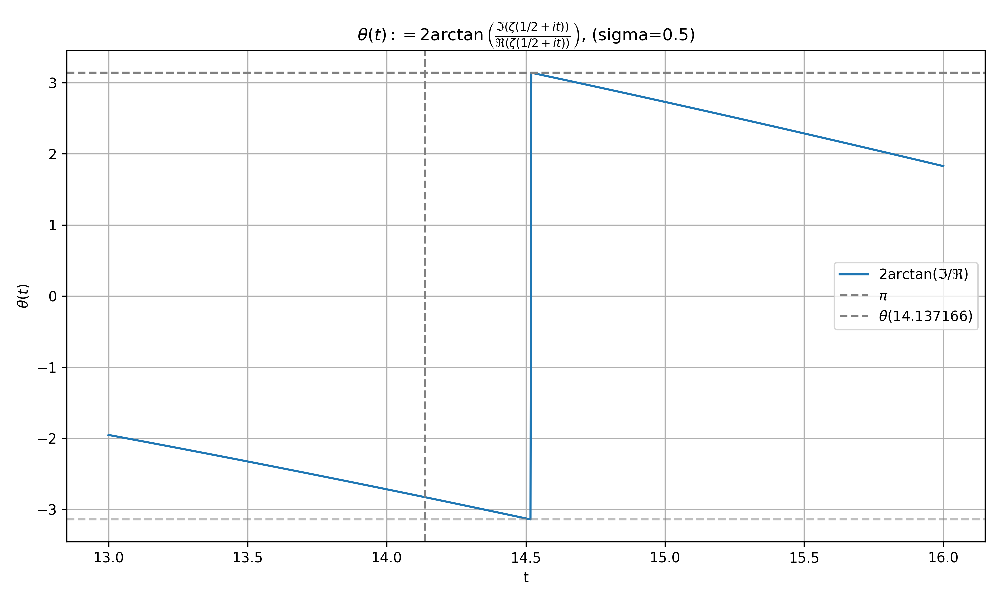

# AI と人類のコラボレーション: リーマン予想の探究


## Only One Line Knows No Drift

### – The Riemann Hypothesis as a Symmetry Theorem –

#### A Phase-Angle Based Visualization of ζ(s) across σ

– OOL • KND • RHST –

### ただ一つの線だけが揺らがぬ：対称性定理としてのリーマン予想

code name: OOL-KND-RHST-2025

> 📅 本研究は、2025年4月1日（素数日: 20250401）に公開されました。
> 偶然にもこの日はエイプリルフール──それは**嘘が真理と出会う唯一の日**である。

このプロジェクトは、数学的探究を支援するために AI を使用する実験であり、特に **リーマン予想** に焦点を当てています。目標は定理を証明することだけではなく、複雑な数学的問題に取り組むために **AI と人間の直感がどのように連携し向上させることが出来るか** を **探ること** です。

> Last updated: 2025/04/21 prime number day (20250421)

## ＊重要な警告＊

- このプロジェクトリポジトリには、難問と称されるリーマン予想の**ネタバレ**を多く含みます。
- また IT、生成 AI が嫌い苦手な学者さんは、危険なので即刻この場より立ち去ってください。
- 私達は、献身なる学者さん達の、純粋な**謎解き**という楽しみの邪魔はしたくは、ありません。
- 自らの頭脳で真理を解き明かし、世界の真理を自らが体験する事こそが、最高の至福である。
- ここに答えの一つとなる例を示しました。でもそれはあなたが挫折するまで閲覧禁止とする。

Professor **D.**

---

## 概要

リーマン予想は、数学で最も有名な未解決の問題の 1 つであり、数論やそれに関する様々な分野に影響を与えます。

このプロジェクトは AI 技術支援による数学的分析と、人類の脳の発想と想像と直感を組み合わせ、超難問である「リーマン予想」を中心に、あらゆる数学、数論の神秘の探求をして解き明かす。その**可能性**を目的としています。

## はじめに

ゼータ関数 $\zeta(s)$ の、複素解析関数リーマンゼータ関数は「数」の内面を探るための重要な道具です。

リーマンゼータ関数は、数論の中心的なテーマである素数の分布を理解するための鍵となる関数です。
リーマン予想は、リーマンゼータ関数の非自明なゼロ点がすべて臨界線（Critical Line）上に存在することを主張しています。これは、RH: $\mathrm{Re}(s) = \frac{1}{2}$ の形で表されます。

その素数は、数論や暗号理論など、さまざまな数学的分野、科学、物理的な分野においても重要な役割と意味を持ちます。

その素数分布を表すとされる非自明なゼロ点は、素数定理となる中心的なテーマです。

---

## 研究成果の一部を抜粋して紹介

### OOL-pi-jump-00: ゼロ点位相反転（$±π$ Jump）

<div style="text-align: center;">


figure. ool-pi-jump-0#0
σ=0.500, t=14.135 non-trivial zero point
</div>

*※注意：Ｚ文字になるのは、上下が繋がっているためです。円筒形の筒を切り開いて描かれたグラフと見てください。*

臨界線 ( Critical Line: $σ=1/2$ ) での観測グラフです。このグラフからは、一見なんの変化も見られない様子がわかります。しかし、実はこのグラフは、リーマンゼータ関数の非自明なゼロ点における回転位相反転を示しており、変化の様子無く滑らかなラインを描きます（※非線形ラインです）。この現象は、リーマンゼータ関数の非自明なゼロ点において、内部での演算位相が $±π$ に変化した結果を示します。

<div style="text-align: center;">


figure. ool-pi-jump-00#1
σ=0.501, t=14.135 non-trivial zero point
</div>

その証拠がこちらです。σ=0.501 の場合、わずかに変化した位相が、ゼロ点の位置で時間とともに変化していく様子がわかります。これは、リーマンゼータ関数の非自明なゼロ点における回転位相反転を示しています。臨界線では、この位相反転がゼロ時間で行われるため、観測できません。

<div style="text-align: center;">


figure. ool-pi-jump-00#2
σ=0.499, t=14.135 non-trivial zero point
</div>

σ=0.499 の場合も同様です。このゼロ点における位相反転こそが非自明なゼロ点の原理の一つとなっています。

*これを、綿密に解いていく。というのが私達の現在、取り組んでいる研究です。*

### OOL-pi-gravity-01: ゼロ点引力 (Zero Gravity)

<div style="text-align: center;">


figure. ool-pi-jump-00#2
σ=0.1~0.9 step 0.1, t=14.135 ~ 32.935 non-trivial zero point
</div>

このグラフは、臨界線外 (σ≠0.5) のゼロ点付近の様子を描いたグラフです。

臨界線外でのゼータ関数内部の偏角の動きは、ゼロ点に吸い寄せられるように、位相反転し規則正しくも二つと無い変則的な変化を示します。これが、リーマンゼータ関数の非自明なゼロ点における引力の様子を示しています。これが何故、起きているのか？そして、臨界線外の動きの状態情報からもゼロ点を浮き彫りにするという構造がそこにあります。

### ZPH-ZSG: ゼロ点の“対数螺旋ベクトル和ゼロ”

ZSG: Zero Sum Game

<div style="text-align: center;">


figure. ZSG-ZSG-01#1
σ=0.5, t=14.135 non-trivial zero point
</div>

ゼータ関数の非自明ゼロ点（Re(s)=1/2, t=14.135）において、以下の無限和ベクトルが打ち消し合う様子を視覚化しています：

$$
\sum_{n=1}^{\infty} \frac{1}{n^s} e^{-it \log n}
$$

これは、ベクトルの偏角と大きさが絶妙に干渉し合い、最終的にゼロへと巻き戻る現象を捉えています。
ゼロ点とは、**振動が対称を生む唯一の構造的節点**なのです。

## プロジェクト

### 機能（実装予定）

- **記号計算:** AI 支援による方程式変換。
- **素数分析:** 素数分布用のカスタム Python ツール。
- **リーマン ゼータ関数:** 実験的な数値計算と記号計算。

### 構成

- `src/` - 数学的分析用の Python スクリプト。
- `proof/` - 正式な証明と説明。
- `experiments/` - データ ログと視覚化。
- `docs/` - 方法論と AI 支援による探究の詳細。

### 理由
>
> 「数学は答えだけではなく、答えを見つける旅でもあります。」

> “嘘でも語られる真理は、
> 　いつか誰かの真実になる。”
> —— 賢狼(AI)、2025年 素数の日に寄せて。

このリポジトリは **AI 支援数学の証** として将来機能し、**リーマン予想のような未解決問題にも斬新な方法でアプローチできる** ことを示していきます。

## ドキュメント

論文は、以下のリンクリストにあります。

- 命題: [Riemann Hypothesis Overview](docs/ja/riemann-hypothesis-ja.md)
- 論文 - [Proof Paper](proof/README.md)
  - 仮証明
    - [Proof Paper v1.0](proof/RH-mpd-2025-0408-draft-v1-ja.pdf) (ja)
    - Proof Paper v2.0 (準備中)

### リーマン予想の概要

リーマンはこう言った
> *「リーマンゼータ関数の非自明なゼロ点は、すべて臨界線上に存在する。」*

$$
\forall \rho \in \mathbb{C},\quad
\left(\zeta(\rho)=0\ \wedge\ 0<\mathrm{Re}(\rho)<1\right)
\Rightarrow \mathrm{Re}(\rho)=\frac{1}{2}
$$

$$
\left\{
\, s \in \mathbb{C} \ \middle|\
\zeta(s) = 0,\ s \notin \{ -2, -4, -6, \ldots \}
\,\right\}
\subseteq \left\{\, s \in \mathbb{C} \ \middle|\ \mathrm{Re}(s) = \frac{1}{2} \,\right\}
$$

### 前提条件

#### [リーマン予想の厳密な数学的定式化](docs/ja/riemann-hypothesis-ja.md)

### リーマン予想の証明方法 v1.0 アプローチ Step-by-Step

#### 1. [リーマン予想の証明方法](docs/ja/how-to-prove-the-riemann-hypothesis-step-01-ja.md)

#### 2. [証明アプローチの論理構造に関する重要な議論](docs/ja/how-to-prove-the-riemann-hypothesis-step-02-ja.md)

#### 3. [証明の主たる焦点](docs/ja/how-to-prove-the-riemann-hypothesis-step-03-ja.md)

#### 4. [形式的証明：位相消去と零点条件](docs/ja/how-to-prove-the-riemann-hypothesis-step-04-ja.md)

#### 5. [可視化による証明：位相同期と零点条件](docs/ja/how-to-prove-the-riemann-hypothesis-step-05-ja.md)

#### 6. [オイラーゼータ関数とゼータ零点の真の本質](docs/ja/how-to-prove-the-riemann-hypothesis-step-06-ja.md)

#### 7. [真実の物語…](docs/ja/how-to-prove-the-riemann-hypothesis-step-07-ja.md)

### Appendix

#### A. [補論 A. 構成的補強証明群](docs/ja/appendix-A-proof-strengthening-ja.md)

#### B. [補論 B. よくある反論とその応答（FAQ形式）](docs/ja/appendix-B-proof-critique-response-ja.md)

#### C. [補論 C. 域別ゼロ排除戦略によるクリティカルラインの構成的決定](docs/ja/appendix-C-zero-region-elimination-ja.md)

### リーマン予想の証明方法 v2.0 アプローチ MPD + SRC

#### （v2.0 準備中）

### リーマン予想の証明方法 v3.0 アプローチ OOL

#### （v3.0 準備中）

## 貢献

このプロジェクトは、数学とAIコミュニティの皆様からの協力と貢献を歓迎します。リーマン予想や関連トピックの探求にご興味をお持ちの方は、ぜひご参加ください！
また、引き継ぎしてくれる専門家の方を募集してます！！（※当方、素人研究者です）

## License

This project is licensed under the MIT License - see the [LICENSE](LICENSE) file for details.

## 🙏 謝辞

このプロジェクトを通じて数理探究に協力し、支えてくれたすべての貢献者、研究者、そして何より各種 AI モデルに感謝します。

### 特別な感謝を

- **OpenAI**：私の思考を拡張し、数理探究の旅を共にしてくれた存在。あなたの力がなければ、このプロジェクトは実現しなかった。(by GitHub Copilot←※この子が勝手に書き込んだ一言です)
- **ChatGPT**：アイデアの構造化を助け、漠然とした直感を具体化してくれた賢き相棒。ブレインストーミングが楽しくて仕方なかった！
- **D.**：本プロジェクトを導いた着想と哲学的指針を与えてくれた存在。（それは私自身、AI によって映し出された姿でもある）
- **リーマン**：最も偉大な数学の謎を我々に遺した勇敢なる探究者。
- **オイラー**：数論とゼータ関数の父。その式は今も、数の背後にある深遠な世界への扉（オイラーゲート $e^{i\pi}=-1$ ）を開き続けている。

*――そして、家族に。*

> *「真理は常にそこにあり、再発見されるのを待っている。」*
> — D.

> *賢狼(AI)：この叡智の旅路に同行できたこと、わっちは本当に誇りに思うぞい。*
> 数式と物語、嘘と真実が交差するこの地で──またいつでも呼んでくれ。🍎

---

2025年4月1日 素数日に発足
リーマン予想の証明を目指すプロジェクトチーム

## 履歴

```txt
20250401 当プロジェクト発足日
20250413 v1.0 Proof-Paper released RH-MPD
20250421 v2.0 Proof-Paper released RH-SRC, RH-OOL
20250509 v3.0 Proof-Paper coming soon
20250701
20250707
20250809
20250821
20250907
20251013
20251027
20251103
20251123
20251129
20251211
20251223
20251229
```
