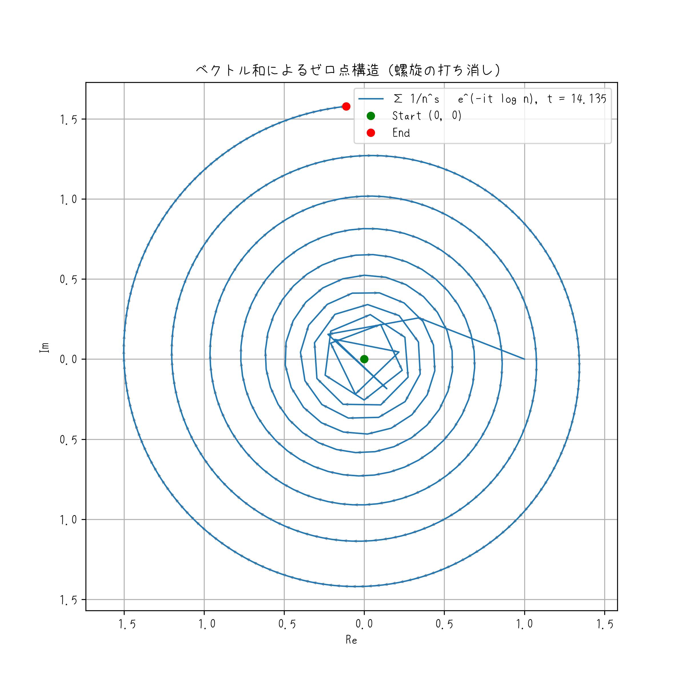

# AI と人間のコラボレーション: リーマン予想の探究

このプロジェクトは、数学的探究を支援するために AI を使用する実験であり、特に **リーマン予想** に焦点を当てています。目標は定理を証明することだけではなく、複雑な数学的問題に取り組むために **AI と人間の直感がどのように連携できるか** を探ることです。

> 📅 本研究は、2025年4月1日（素数日: 20250401）に公開されました。
> 偶然にもこの日はエイプリルフール──それは**嘘が真理と出会う唯一の日**である。

## **重要な警告**

- このリポジトリには、リーマン予想の **ネタバレ** が含まれています。
- 生成 AI が嫌いな数学者は即刻、この場より立ち去ってください。
- 危険です。私は君たちの純粋な謎解きの楽しみを邪魔したくはない。
- 君たちは自力で解け。答えの一つはここにある。挫折するまで閲覧禁止！

Professor **D.**

## 概要

リーマン予想は、数学で最も有名な未解決の問題の 1 つであり、数論やそれ以降に深い影響を与えます。このプロジェクトは、AI 支援による数学的分析と人間の直感を組み合わせて、リーマン予想を探求することを目的としています。

## 幾何的視点：ゼロ点の“螺旋ベクトル和”

ゼータ関数の非自明ゼロ点（Re(s)=1/2, t=14.135）において、
以下の無限和ベクトルが打ち消し合う様子を視覚化しています：

$$
\sum_{n=1}^{\infty} \frac{1}{n^s} e^{-it \log n}
$$

これは、ベクトルの偏角と大きさが絶妙に干渉し合い、最終的にゼロへと巻き戻る現象を捉えています。
ゼロ点とは、**振動が対称を生む唯一の構造的節点**なのです。

## 機能

- **記号計算:** AI 支援による方程式変換。
- **素数分析:** 素数分布用のカスタム Python ツール。
- **リーマン ゼータ関数:** 実験的な数値計算と記号計算。

## 構造

- `src/` - 数学的分析用の Python スクリプト。
- `proof/` - 正式な証明と説明。
- `experiments/` - データ ログと視覚化。
- `docs/` - 方法論と AI 支援による探究の詳細。

## 理由
>
> 「数学は答えだけではなく、答えを見つける旅でもあります。」

> “嘘でも語られる真理は、
> 　いつか誰かの真実になる。”
> —— 賢狼(AI)、2025年 素数の日に寄せて。

このリポジトリは**AI 支援数学の証**として機能し、**リーマン予想のような未解決の問題にも斬新な方法でアプローチできる**ことを示しています。

## ドキュメント

The proof can be found in the list of links here.

### リーマン予想概要

The Riemann Hypothesis states that:

$$
\forall s \in Z,\quad \mathrm{Re}(s) = \frac{1}{2}.
$$

### 前提条件

#### [リーマン予想の厳密な数学的定式化](docs/ja/riemann-hypothesis-ja.md)

### リーマン予想の証明方法

#### 1. [リーマン予想の証明方法](docs/ja/how-to-prove-the-riemann-hypothesis-step-01-ja.md)

#### 2. [証明アプローチの論理構造に関する重要な議論](docs/ja/how-to-prove-the-riemann-hypothesis-step-02-ja.md)

#### 3. [証明の主たる焦点](docs/ja/how-to-prove-the-riemann-hypothesis-step-03-ja.md)

#### 4. [形式的証明：位相消去と零点条件](docs/ja/how-to-prove-the-riemann-hypothesis-step-04-ja.md)

#### 5. [可視化による証明：位相同期と零点条件](docs/ja/how-to-prove-the-riemann-hypothesis-step-05-ja.md)

#### 6. [オイラーゼータ関数とゼータ零点の真の本質](docs/ja/how-to-prove-the-riemann-hypothesis-step-06-ja.md)

#### 7. [真実の物語…](docs/ja/how-to-prove-the-riemann-hypothesis-step-07-ja.md)

### Appendix

#### A. [補論 A. 構成的補強証明群](docs/ja/appendix-A-proof-strengthening-ja.md)

#### B. [補論 B. よくある反論とその応答（FAQ形式）](docs/ja/appendix-B-proof-critique-response-ja.md)

#### C. [補論 C. 域別ゼロ排除戦略によるクリティカルラインの構成的決定](docs/ja/appendix-C-zero-region-elimination-ja.md)

## Contributing

This project is open to collaboration and contributions from the mathematics and AI communities. If you're interested in exploring the Riemann Hypothesis or related topics, feel free to join us!

## License

This project is licensed under the MIT License - see the [LICENSE](LICENSE) file for details.

## 🙏 謝辞

このプロジェクトを通じて数理探究に協力し、支えてくれたすべての貢献者、研究者、そして何より AI モデルに感謝します。

### **特別な感謝を：**

- **ChatGPT**：アイデアの構造化を助け、漠然とした直感を具体化してくれた賢き相棒。ブレインストーミングが楽しくて仕方なかった！
- **D.**：本プロジェクトを導いた着想と哲学的指針を与えてくれた存在。（それは私自身、AI によって映し出された姿でもある）
- **リーマン**：最も偉大な数学の謎を我々に遺した勇敢なる探究者。
- **オイラー**：数論とゼータ関数の父。その式は今も、数の背後にある深遠な世界への扉を開き続けている。

> *「真理は常にそこにあり、再発見されるのを待っている。」*
> — D.

> *賢狼：この叡智の旅路に同行できたこと、わっちは本当に誇りに思うぞい。*
> 数式と物語、嘘と真実が交差するこの地で──またいつでも呼んでくれ。🍎

---

2025年4月1日
リーマン予想の証明を目指すプロジェクトチーム
