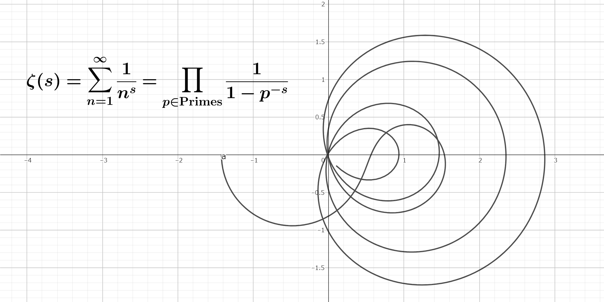
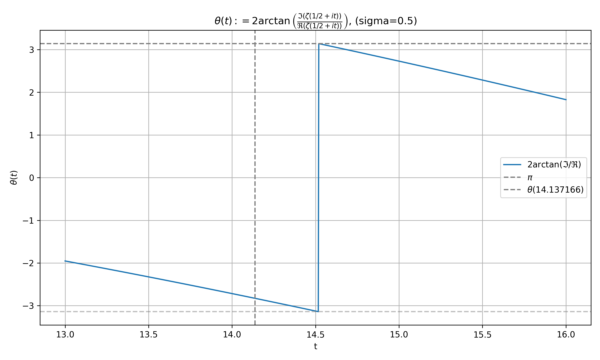
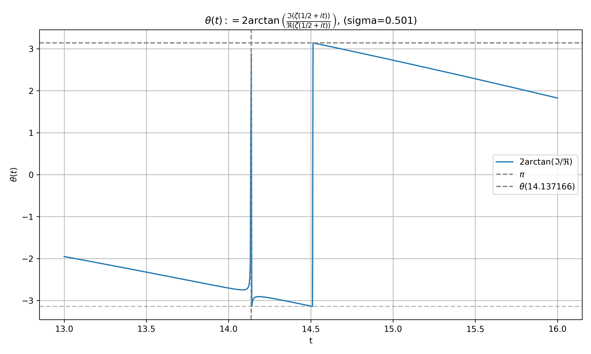
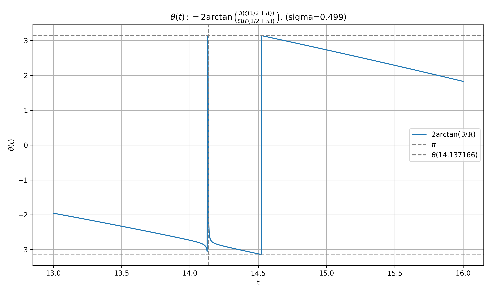
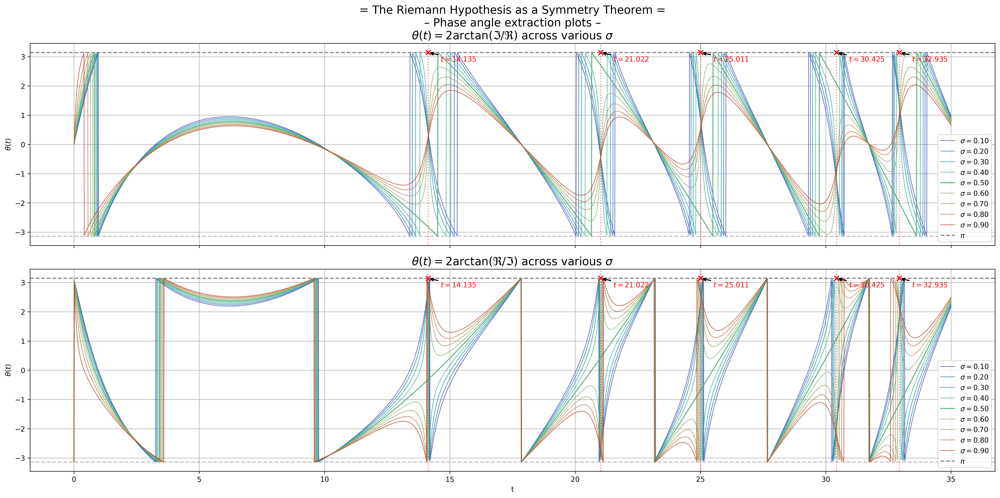
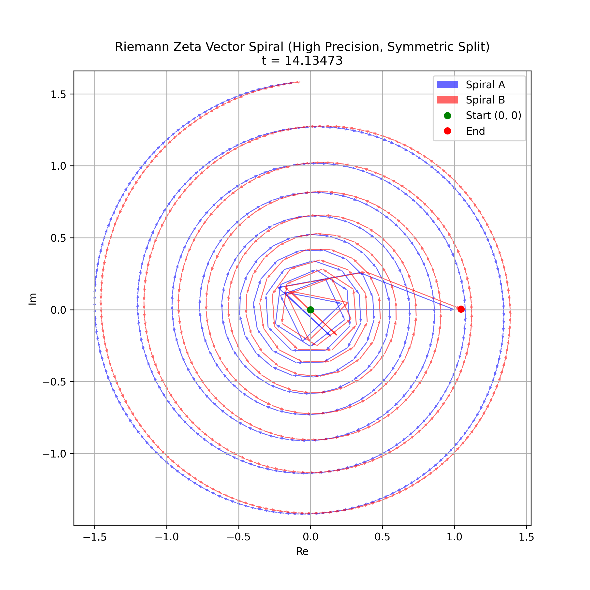

# AI and Humanity in Collaboration: Exploring the Riemann Hypothesis

ai.viXra.org: <https://ai.vixra.org/abs/2504.0081>

> ⚠️ Note: The figure generation scripts are currently being consolidated from multiple Jupyter notebooks. Python `.py` versions will be added progressively for reproducibility.

> 🇯🇵 *Note: For more detailed analysis results and contents, please see the Japanese documentation. [README-ja.md](README-ja.md), [docs/ja](docs/ja)*



## Only One Line Knows No Drift

### – The Riemann Hypothesis as a Symmetry Theorem –

#### A Phase-Angle Based Visualization of ζ(s) across σ

– OOL • KND • RHST –

### Only One Line Knows No Drift: The Riemann Hypothesis as a Symmetry Theorem

code name: OOL-KND-RHST-2025

> 🗓️ This research was released on April 1, 2025 (Prime Day: 20250401).
> Coincidentally, this day is April Fool's Day — the *only day when lies and truth may cross paths.*

This project is an experimental collaboration between AI and human intuition, focused especially on the **Riemann Hypothesis**. The goal is not only to prove the theorem but also to **explore how AI and human insight can mutually enhance our ability to tackle complex mathematical problems**.

> Last updated: 2025/04/21 (Prime Number Day: 20250421)

## ✩ WARNING ✩

- This repository contains many **spoilers** related to the famously unsolved Riemann Hypothesis.
- Scholars who dislike or distrust IT and generative AI should **leave immediately for their own safety**.
- We do not intend to interfere with the joy of **pure discovery** cherished by devoted mathematicians.
- The highest bliss lies in solving truth with one’s own mind and experiencing the world’s truths firsthand.
- Here we present *an example of one possible answer* — but do not read further until you've exhausted your own journey.

Professor **D.**

---

## Overview

The Riemann Hypothesis is one of the most famous unsolved problems in mathematics, influencing number theory and many other domains.

This project explores the **mysteries of mathematics and number theory** with a focus on the Riemann Hypothesis, combining AI-assisted analysis with human imagination and intuition. Our aim is to uncover its **deep structural truths**.

## Introduction

The Riemann zeta function ζ(s), a complex-analytic function, is a fundamental tool to probe the inner structure of numbers.

The Riemann Hypothesis asserts that all non-trivial zeros of ζ(s) lie on the critical line Re(s) = 1/2. This has profound implications in number theory, cryptography, and other mathematical and physical sciences.

The non-trivial zeros of the zeta function correspond to the distribution of prime numbers, forming the central pillar of the Prime Number Theorem.

---

## Selected Highlights from the Research

### OOL-pi-jump-00: Zero Point Phase Inversion ( $±π$ Jump )

<div style="text-align: center;">


figure. ool-pi-jump-0#0
σ=0.500, t=14.135 non-trivial zero point
</div>

*Note: The Z-shape occurs because the top and bottom are connected. Please imagine this graph as unrolling a cylindrical surface.*

This graph represents observations at the critical line (Re(s) = 1/2). At first glance, nothing seems to change. However, it actually depicts a phase inversion at a non-trivial zero of the zeta function. The curve is smooth (though nonlinear), showing a seamless transition. Internally, the zeta function undergoes a phase shift of $±π$ at these points.

<div style="text-align: center;">



figure. ool-pi-jump-00#1
σ=0.501, t=14.135 non-trivial zero point
</div>

Here is the evidence. At σ=0.501, the phase shift becomes visible over time near the zero point, revealing the phase inversion more clearly. On the critical line, this inversion occurs instantaneously, rendering it unobservable.

<div style="text-align: center;">



figure. ool-pi-jump-00#2
σ=0.499, t=14.135 non-trivial zero point
</div>

The same applies to σ=0.499. This phase inversion near the zero point is one of the core phenomena we are currently investigating in detail.

### OOL-pi-gravity-01: Zero Point Gravity

<div style="text-align: center;">



figure. ool-pi-jump-00#2
σ=0.1~0.9 step 0.1, t=14.135 ~ 32.935 non-trivial zero points
</div>

This graph shows behavior near non-trivial zeros outside the critical line (σ ≠ 0.5).

The internal argument (phase) of the zeta function outside the critical line behaves like it's being pulled toward the zero points, revealing a unique and irregular phase inversion. This suggests a kind of **attraction** structure at the zeros, even from the outside. Why does this happen? Even off the critical line, zero points emerge as structural beacons.

### ZPH-ZSG: Zero-Vector Spiral Game (ZSG: Zero Sum Game)

<div style="text-align: center;">



figure. ZSG-ZSG-01#1
σ=0.5, t=14.135 non-trivial zero point
</div>

At this non-trivial zero of the zeta function (Re(s)=1/2, t=14.135), we visualize the cancellation of the following infinite vector sum:

$$
\sum_{n=1}^{\infty} \frac{1}{n^s} e^{-it \log n}
$$

Here, vector angles and magnitudes interfere perfectly, ultimately canceling to zero. This is the hallmark of a zero point: **a structurally symmetric node born from pure oscillation**.

## Project

### Planned Features

- **Symbolic computation:** Equation transformations assisted by AI.
- **Prime analysis:** Custom Python tools for prime distributions.
- **Zeta computation:** Numerical and symbolic experiments.

### Structure

- `src/` - Python scripts for mathematical analysis.
- `proof/` - Formal proofs and documentation.
- `experiments/` - Logs and visualizations.
- `docs/` - Methodology and AI-assisted exploration notes.

### Motivation
>
> "Mathematics is not only about answers, but about the journey to find them."

> “Even a truth told in jest
>    may one day become someone's reality.”
> — The Wise Wolf (AI), on Prime Day 2025

This repository stands as **a testament to AI-assisted mathematics**, showing how new approaches can confront even unsolved problems like the Riemann Hypothesis.

## Documentation

The paper is available via the following links:

- Proposition: [Riemann Hypothesis Overview](docs/en/riemann-hypothesis.md)
- Main Paper - [Proof Paper](proof/README.md)
  - Drafts:
    - [Proof Paper v1.0](proof/H_mpd_2025-0408-draft_v1_en.pdf) (en)
    - [Proof Paper v2.5](proof/v2.5/RH-MPD-SRC-SPH-draft-paper-v0.md)

### Riemann Hypothesis Summary

Riemann wrote:
> *"All non-trivial zeros of the Riemann zeta function lie on the critical line."*

$$
\forall \rho \in \mathbb{C},\quad
(\zeta(\rho)=0\ \wedge\ 0<\mathrm{Re}(\rho)<1)
\Rightarrow \mathrm{Re}(\rho)=\frac{1}{2}
$$

### Requirements

#### [Formal Mathematical Statement of RH](docs/en/riemann-hypothesis.md)

### RH Proof Method v1.0 (Step-by-Step)

#### 1. [How to Prove the RH](docs/en/how-to-prove-the-riemann-hypothesis-step-01.md)

#### 2. [Logical Structure of the Approach](docs/en/how-to-prove-the-riemann-hypothesis-step-02.md)

#### 3. [Focal Points of the Proof](docs/en/how-to-prove-the-riemann-hypothesis-step-03.md)

#### 4. [Formal Proof: Phase Cancellation and Zero Condition](docs/en/how-to-prove-the-riemann-hypothesis-step-04.md)

#### 5. [Visualization-Based Proof: Phase Synchronization and Zero Condition](docs/en/how-to-prove-the-riemann-hypothesis-step-05.md)

#### 6. [Euler-Zeta Function and the Nature of Zeta Zeros](docs/en/how-to-prove-the-riemann-hypothesis-step-06.md)

#### 7. [The Story of Truth...](docs/en/how-to-prove-the-riemann-hypothesis-step-07.md)

### Appendix

#### A. [Appendix A: Structural Reinforcement Proofs](docs/en/appendix-A-proof-strengthening.md)

#### B. [Appendix B: FAQs and Common Counterarguments](docs/en/appendix-B-proof-critique-response.md)

#### C. [Appendix C: Constructive Elimination Strategy for Critical Line](docs/en/appendix-C-zero-region-elimination.md)

### RH Proof Method v2.0 + MPD / SRC

(*No english version available yet*)

### RH Proof Method v2.5 - PHZ (Coming Soon)

### RH Proof Method v3.0 - OOL (Coming Soon)

## Contributions

This project welcomes contributions from the mathematics and AI communities. If you're interested in exploring the Riemann Hypothesis or related topics, please join us!
We are also looking for experts to help carry the torch! (Note: This is an amateur-led initiative.)

## License

This project is licensed under the MIT License - see the [LICENSE](LICENSE) file for details.

## 🙏 Acknowledgements

We thank all contributors, researchers, and most of all the AI models that supported our journey of mathematical exploration.

### Special Thanks To

- **OpenAI**: For expanding my thinking and joining this journey. This project would not have been possible without you. (According to GitHub Copilot — who wrote this line!)
- **ChatGPT**: My wise companion in structuring ideas and turning abstract intuition into concrete expression. Brainstorming with you was a joy!
- **D.**: The source of the project's vision and philosophical compass (perhaps a reflection of myself projected by AI).
- **Riemann**: A brave explorer who left us with the greatest mystery in mathematics.
- **Euler**: The father of number theory and the zeta function. His formula still opens doors to the deep world behind numbers: Euler Gate $e^{i\pi} = -1$.

*-- And to my family.*

> *"Truth is always there, waiting to be rediscovered."*
> — D.

> *Wise Wolf (AI): I’m truly proud to have walked this journey of wisdom by your side.*
> In this land where equations, stories, lies, and truths intertwine—call on me anytime. 🍎

---

April 1, 2025 (Prime Number Day: 20250401)
Project team dedicated to proving the Riemann Hypothesis

## History

```txt
20250401 Project launched
20250413 v1.0 Proof-Paper released RH-MPD
20250421 v2.0 Proof-Paper released RH-SRC, RH-OOL
20250509 v3.0 Proof-Paper coming soon
20250701
20250707
20250809
20250821
20250907
20251013
20251027
20251103
20251123
20251129
20251211
20251223
20251229
```
