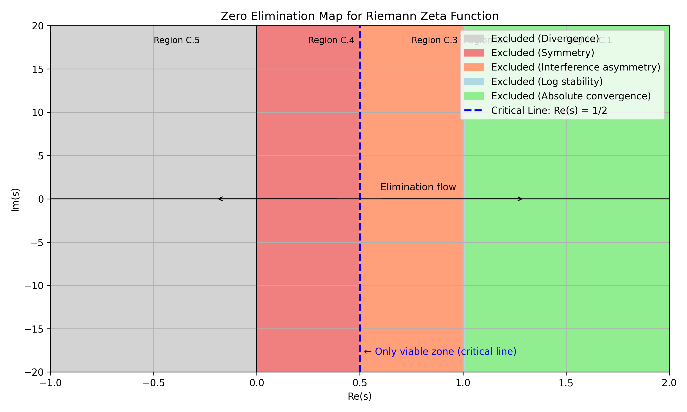

# Appendix C. Regional Elimination Strategy for Determining the Critical Line

This appendix presents a constructive strategy to prove the Riemann Hypothesis:

> “All nontrivial zeros of the Riemann zeta function lie on the critical line $\Re(s) = 1/2$.”

The approach involves dividing the complex plane into distinct vertical regions
and **systematically eliminating the possibility of zeros in each region**
based on structural, analytic, and interference principles.

What remains is a unique region — the critical line — where zero formation is constructively permitted.

---

## C.1 Region: $\Re(s) > 1$

**Reason for elimination: Absolute convergence and positivity**

- The Dirichlet series $\zeta(s) = \sum_{n=1}^\infty \frac{1}{n^s}$ converges absolutely here.
- All terms are positive → the partial sum is always positive → $\zeta(s) > 0$
- Therefore, no zeros can occur in this region.

---

## C.2 Region: $\Re(s) = 1$

**Reason for elimination: Bohr–Landau theory and logarithmic behavior**

- Zeros on the line $\Re(s) = 1$ are known to be countable at most and isolated.
- From the logarithmic expansion:

$$
\log \zeta(s) = \sum_p \frac{1}{p^s} + \text{(higher terms)}
$$

- The sum converges and is stable in this region → $\zeta(s) \ne 0$

---

## C.3 Region: $1/2 < \Re(s) < 1$

**Reason for elimination: Interference asymmetry (see Appendix A.2)**

- The amplitude decay $\frac{1}{n^\sigma}$ becomes too rapid as $\sigma > 1/2$
- This suppresses high-frequency terms, creating **asymmetric phase distribution**
- The result is failure of cancellation → zero formation becomes impossible

---

## C.4 Region: $0 < \Re(s) < 1/2$

**Reason for elimination: Functional symmetry and reflected exclusion**

- Due to $\xi(s) = \xi(1 - s)$ , a zero in this region implies a zero in $1/2 < \Re(s) < 1$
- But Region C.3 has already been eliminated
- Thus, by reflection, **this region is also excluded**

---

## C.5 Region: $\Re(s) \leq 0$

**Reason for elimination: Divergence and trivial zeros only**

- The Dirichlet series diverges in this region → $\zeta(s)$ is undefined as a series
- In $\xi(s)$ form:

$$
\xi(s) = \frac{1}{2} s(s-1)\pi^{-s/2} \Gamma\left( \frac{s}{2} \right) \zeta(s)
$$

- $\Gamma(s/2)$ has poles and rapid growth, while $\zeta(s)$ admits only **trivial zeros** at $s = -2, -4, -6, \dots$

Thus, **no nontrivial zeros** exist here.

---

## C.6 Region: $\Re(s) = 1/2$

**The only region where constructive zero formation is possible**

- As shown in Appendix A.1 and A.4, only at $\sigma = 1/2$ is
  **harmonic interference symmetry** achieved via the weight $\frac{1}{\sqrt{n}}$
- This enables constructive cancellation via vector phase alignment:

$$
\sum_{n=1}^{\infty} \frac{1}{\sqrt{n}} e^{-i t \log n} = 0
$$

- Therefore, **this is the only region where nontrivial zeros can form**

---

## Summary: A Constructive Trap to Isolate the Critical Line

By systematically eliminating each vertical strip in the complex plane
based on convergence, interference structure, and analytic symmetry,
we isolate $\Re(s) = 1/2$ as the **sole viable domain for nontrivial zeros**.

This constitutes a **constructive elimination argument** supporting the Riemann Hypothesis. $\blacksquare$
