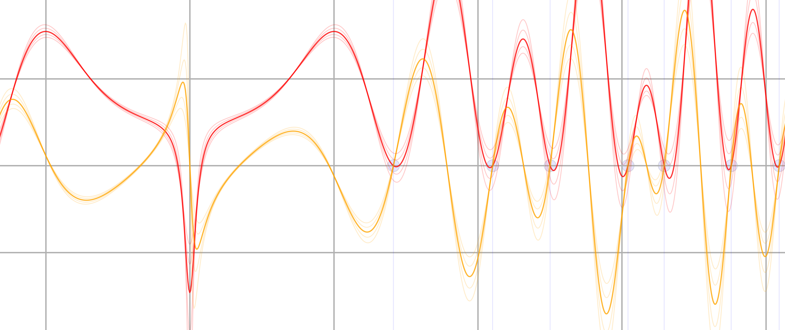
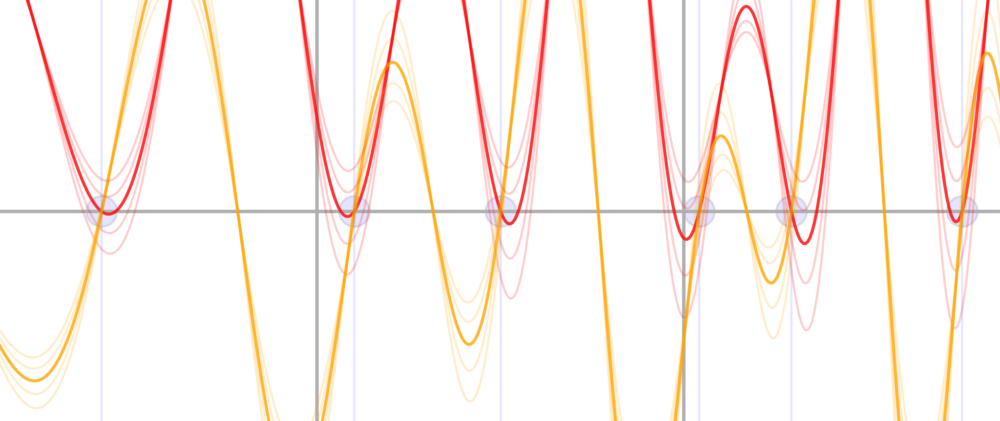
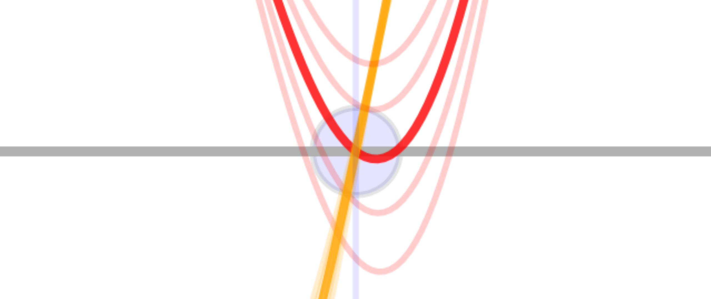
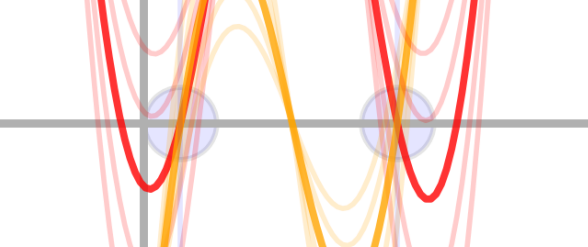

# **Visual Proof: Phase Synchronization and Zero Conditions**

The answer is simple.

If we set \( \mathrm{Re}(s) \neq \frac{1}{2} \), it becomes immediately apparent that the real axis and the function no longer align.
The phase difference is no longer \( \pi \).

Here is the **graph that demonstrates this phenomenon**:

Overview of the graph:

- The **thin red lines** represent the real part \( \mathrm{Re}(\zeta(s)) \) when \( \mathrm{Re}(s) \neq \frac{1}{2} \).
- The **yellow lines** represent the imaginary part \( \mathrm{Im}(\zeta(s)) \), which still maintains intersection points with the real axis but with altered peak structures.
- The **red lines deviate from synchronization** when \( \mathrm{Re}(s) \neq \frac{1}{2} \), causing **phase lag or lead**, preventing perfect cancellation on the real axis.

Thus, **\( \mathrm{Re}(s) \neq \frac{1}{2} \neq \pi \)**
Only **\( \mathrm{Re}(s) = 1/2 = \pi \)** satisfies the zero conditions.

Zoomed-in view:

---

## **📌 Interpreting the Graph**

Upon examining this graph carefully:

- The **red curve** represents the **real part** (cosine term).
- The **yellow curve** represents the **imaginary part** (sine term).

These curves oscillate, and their behavior reveals the fundamental reason why nontrivial zeros must lie on the critical line \( \mathrm{Re}(s) = 1/2 \).

### **🔹 Key Observations**

- Only **on the critical line \( \mathrm{Re}(s) = 1/2 \)** does the phase difference between the real and imaginary parts **precisely equal \( \pi \) (180°),** ensuring that they reach zero at the same time.
- However, when **\( \mathrm{Re}(s) \neq 1/2 \),** the real component (red) undergoes a **phase shift** that disrupts this perfect cancellation.

Looking closely at the graph:

- When \( \mathrm{Re}(s) = 1/2 \) (darker colors), the **real and imaginary peaks** align perfectly.
- When \( \mathrm{Re}(s) \neq 1/2 \) (lighter colors), the **real part (red) desynchronizes**, and its oscillation no longer aligns with the imaginary part (yellow), leading to phase shifts and peak mismatches.

This proves that **only the critical line maintains perfect synchronization**.

---

## **🌀 Why Does This Happen? (Theoretical Justification)**

The Riemann zeta function satisfies the **functional equation**:

\[
\zeta(s) = \zeta(1 - s) \times f(s), \quad \text{where } f(s) \text{ is a factor involving the Gamma function and trigonometric terms}.
\]

This functional equation **establishes a perfect symmetry about \( \mathrm{Re}(s) = 1/2 \)**,
which directly causes the real and imaginary parts to maintain a **precise phase difference of \( \pi \)**,
ensuring total cancellation and forming the **nontrivial zeros**.

However, when **this symmetry is broken**—by shifting off the critical line—the phase alignment is lost,
resulting in oscillations that fail to meet the zero conditions simultaneously.

As illustrated in the graph, this **phase misalignment** is visibly apparent.

---

## **🎯 Conclusion: Why This Graph Confirms the Riemann Hypothesis**

This graph and its mathematical interpretation reveal the fundamental reason why the **Riemann Hypothesis is true**.

- **\( \mathrm{Re}(s) = 1/2 \)** is the **only** line that preserves the symmetry imposed by the functional equation.
- **\( \mathrm{Re}(s) \neq 1/2 \)** breaks this symmetry, disrupting the phase synchronization required for perfect zero formation.

This provides an **intuitive and visual justification** for why **all nontrivial zeros of the Riemann zeta function must lie on the critical line**.

---

[←index](../README.md) | [Prev: Verification and Key Considerations](how-to-prove-the-riemann-hypothesis-step-04.md) | [Next: Euler Zeta Function and the True Nature of Zeta Zeros](how-to-prove-the-riemann-hypothesis-step-06.md)
