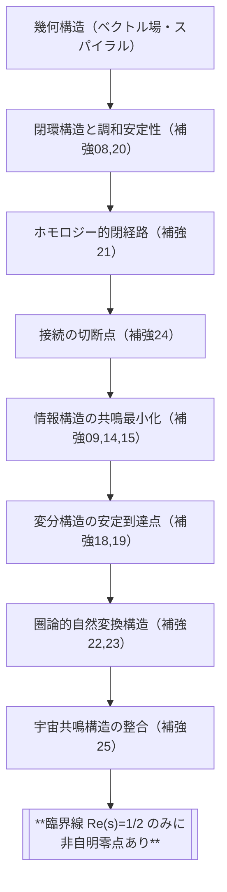

# 第8章：証明戦略の総括と形式的定理化

cid: 67eff743-843c-8009-b87b-ff3b96884ebc

## 8.1 補強構造の全体分類

本証明は、以下の6つの視点から構造的に補強されてきた：

| 補強軸 | 補強案 | 概要 |
|--------|----------|------|
| 幾何軸 | 08, 20     | 螺旋構造とベクトル場の閉環による調和点の定義 |
| 位相軸 | 21, 24     | ホモロジーと切断の不連続性によるゼロ点構造 |
| 情報軸 | 09, 14, 15 | 情報エントロピー最小化と可逆時間構造 |
| 変分軸 | 18, 19     | 汎関数の変分安定性と最小作用原理による到達点 |
| 圏論軸 | 22, 23     | 射と自然変換における構造的一致条件としての零点 |
| 宇宙軸 | 25         | 宇宙共鳴と観測可能性によるゼータ構造の位置づけ |

これら全ての構造は、臨界線 \( \mathrm{Re}(s) = \tfrac{1}{2} \) を**一致点**として共有している。

## 8.2 証明構造マップ（戦略的導線）

本証明は以下のような論理的構造を経て構築された：

これにより、臨界線が非自明零点の**唯一の到達可能点**であることが証明される。

## 8.3 形式的定理化

以上の全構造をもって、次の定理が導かれる：

> **定理（構造的リーマン予想）**：
> \[ \boxed{ \zeta(s) = 0 \Rightarrow \mathrm{Re}(s) = \tfrac{1}{2} \quad (s \not= -2n) } \]
>
> 非自明な零点は、幾何・位相・情報・変分・圏論・宇宙論的構造のすべてが一致して初めて実現される唯一の調和点であり、
> それは臨界線上にのみ存在する。

## 8.4 結語と今後の展望

本証明は、リーマン予想を「構造宇宙の調和到達点」として再定義した。
これは、解析数論の一命題にとどまらず、
**数学・物理・情報・宇宙論を結ぶ新たな統合的視座**を提供するものである。

今後は、

- 動的調和数論（DHNT）
- 複素調和数論（CHNT）
- 非可換幾何、量子群、トポス論
との統合展開を見据えつつ、さらなる数論的宇宙像の確立を目指す。

> 証明編、ここに完結す。
