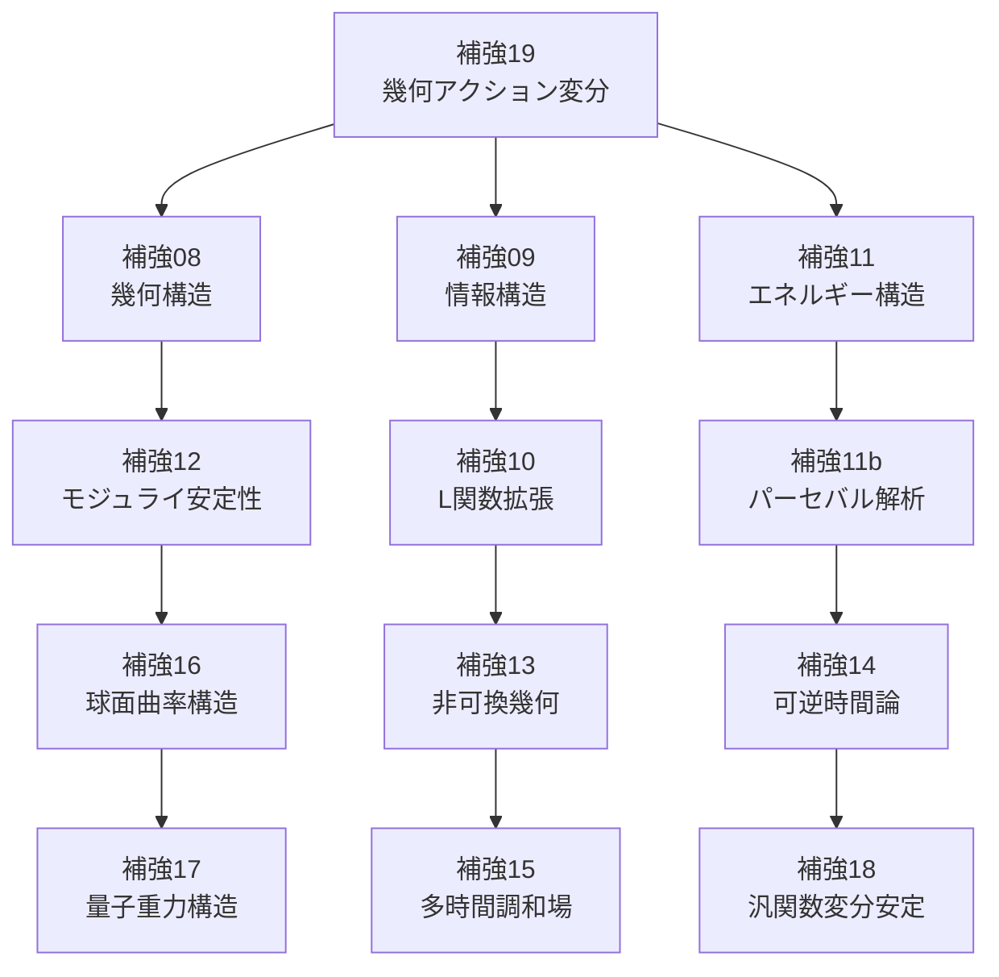

# 補強案08〜19：全体構造マップ草案

---

## 🧭 1. 概要

本構造マップでは、補強案08〜19までの内容を系統立てて整理し、
各章の位置づけと相互関係を視覚的・構造的に明確化する。

目的は以下の3点：

- 全補強の「構造的統合像」の提示
- 臨界線 \( \mathrm{Re}(s) = 1/2 \) を中心とした共鳴構造の多視点展開
- 複数領域（幾何・情報・物理・非可換・時間）を統合する証明戦略の枠組み化

---

## 🔷 2. 全補強案の領域分類と軸構造

| 領域      | 補強案 | 内容概略 | 臨界線の意味 |
|-----------|--------|----------|----------------|
| 幾何構造  | 08     | 螺旋構造とエネルギー平均 | 成長と調和の釣り合い点 |
|           | 12     | モジュライ安定性        | 安定構成の唯一構成点 |
|           | 16     | 球面曲率と零点配置      | 赤道対称面・等ポテンシャル線 |
|           | 19     | 幾何アクションの変分     | 最小作用の安定経路 |
| 情報理論  | 09     | 情報エントロピー        | 情報干渉の最小点 |
|           | 10     | L関数拡張               | Dirichlet空間での共鳴干渉点 |
| エネルギー論 | 11  | 分配関数構造             | エネルギー平衡と調和点 |
| スペクトル論 | 13  | 非可換幾何と代数核      | 作用素空間の共鳴構造 |
| 時間論     | 14     | 可逆時間と情報軸        | 時間双対性の固定線 |
|           | 15     | 多時間次元               | 高次臨界対称超面 |
| 重力時空   | 17     | 量子重力とスペクトル     | 離散幾何構造の共鳴点 |
| 汎関数論   | 18     | ゼータ汎関数の変分安定性 | エネルギー構成の極小点 |

---

## 🧩 3. 構造連鎖と中心軸

ゼータの臨界線 \( \mathrm{Re}(s) = 1/2 \) を中心軸とする補強構造：

これにより、臨界線は：

- 幾何的にも最小曲線
- 情報的にもエントロピー最小構造
- エネルギー的にも平衡点
- 時空構造的にも双対線
- 代数的にもスペクトルの消失点
- 汎関数的にも安定変分点

として現れ、補強構造全体の「共鳴中枢軸」となる。

---

## 🧠 4. 証明構造としての応用戦略

この構造マップは、以下のような戦略的応用が可能である：

- 各分野の数学的道具（例：変分法、NCG、情報幾何）をゼータ構造に適用
- 各構造視点から臨界線 \( \mathrm{Re}(s) = 1/2 \) の必然性を導出
- 多視点的整合による「構造的一致性による証明」

したがって、これらの補強案は単なる補足ではなく、
リーマン予想の「全体統合的な証明スキームの柱」となる。

---

## 🔚 5. 次の展望：書籍構成・章立て・可視化化

この構造を基盤とし、次のステップとして：

- 書籍化に向けた章立て構成案
- ビジュアルマップ（図・表・年表）
- 各章要約と冒頭命題整理

などへ進む準備が整った。

> ご希望に応じて次の設計に着手可。
