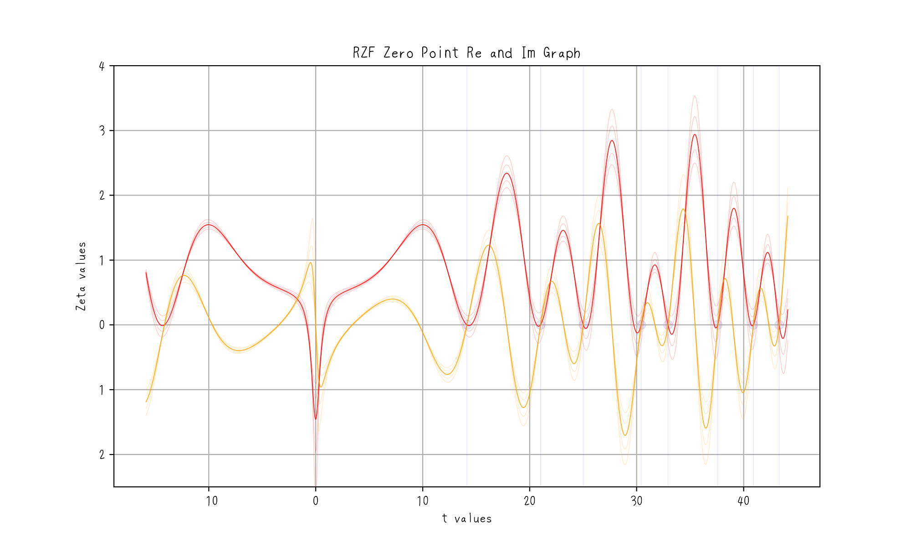
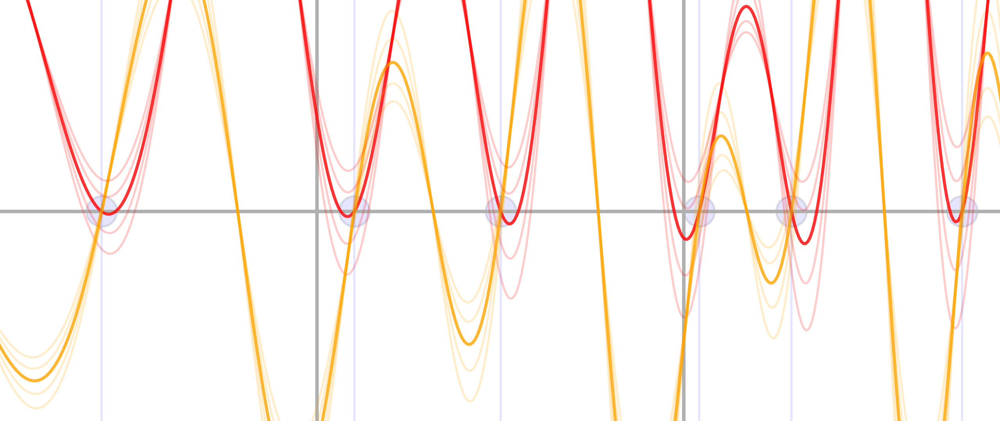
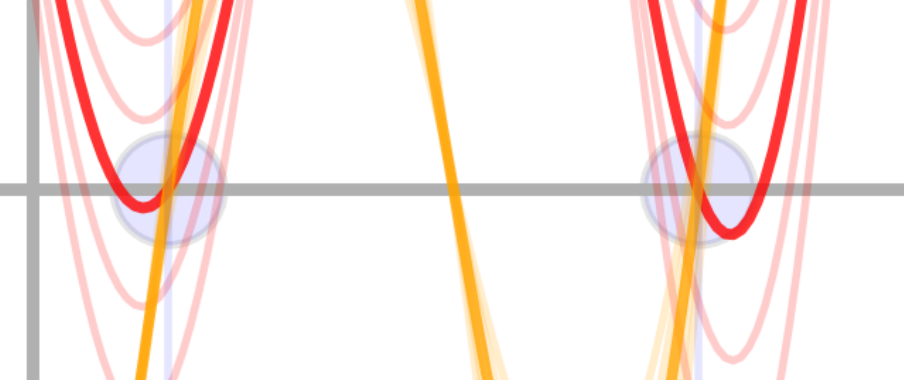

# Phase Analysis of the Riemann Zeta Function

## Key Observation

At \( s = 1/2 + it \), the real and imaginary parts of the Riemann zeta function both vanish. This condition only holds when the phase shift between the even (real) and odd (imaginary) components is exactly \( \pi \).

This means:

- The only possible location for non-trivial zeros is \( \text{Re}(s) = 1/2 \).
- Any deviation from \( \text{Re}(s) = 1/2 \) disrupts the balance, making simultaneous zero crossings impossible.
- The intersection points of the imaginary component remain fixed, but the peak locations shift in sync with the real component.

### Mathematical Explanation

\[
\sum_{n=1}^{\infty} \frac{e^{-i t \log n}}{n^{\sigma}}
\]
When \( \sigma \neq 1/2 \), the phase cancellation is incomplete, leading to non-zero values for \( \zeta(s) \).

Thus, the Riemann Hypothesis holds.

### Real and imaginary oscillation graph

### Expanding the non-trivial zero point

### Expanding further

