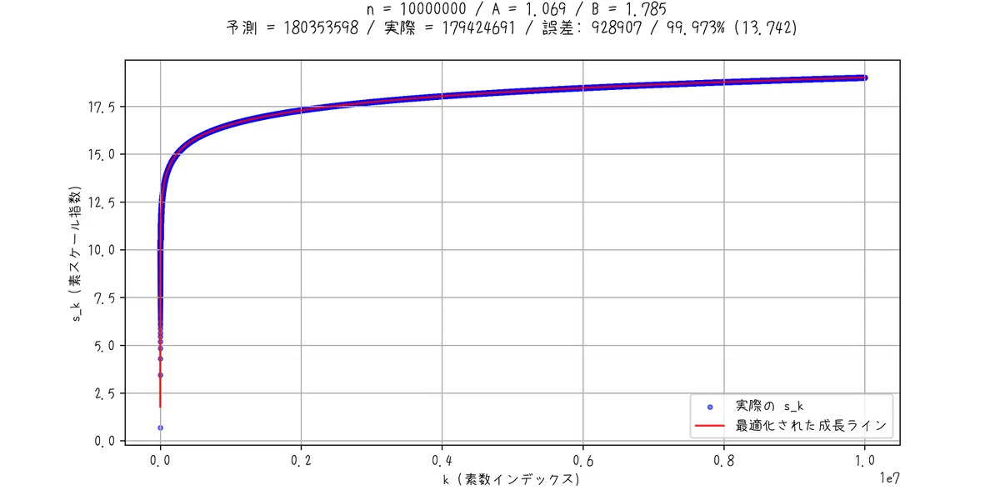
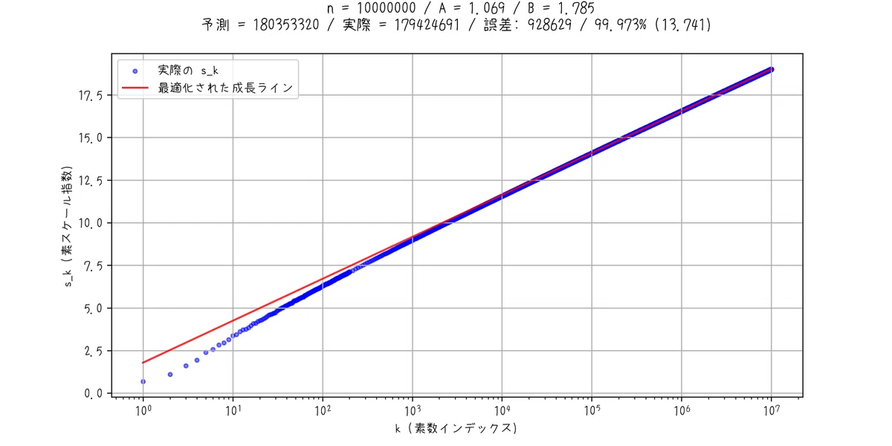
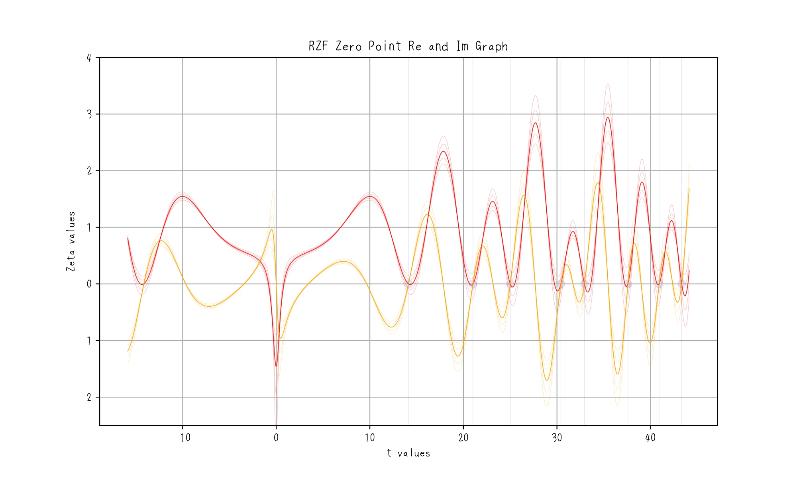
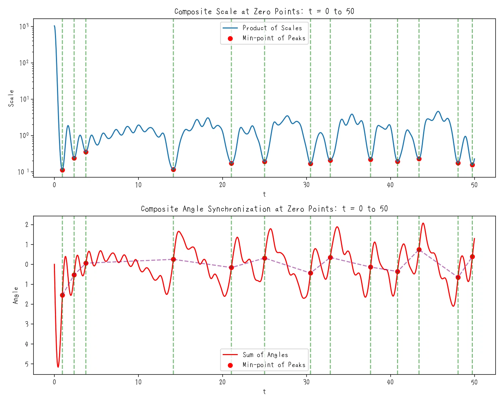
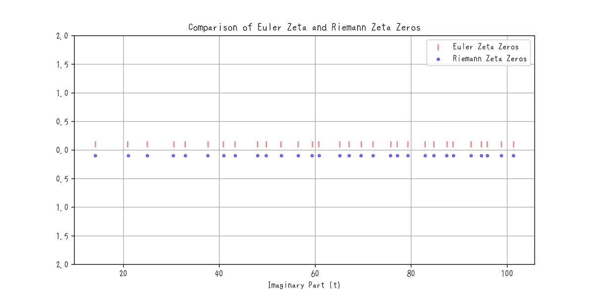
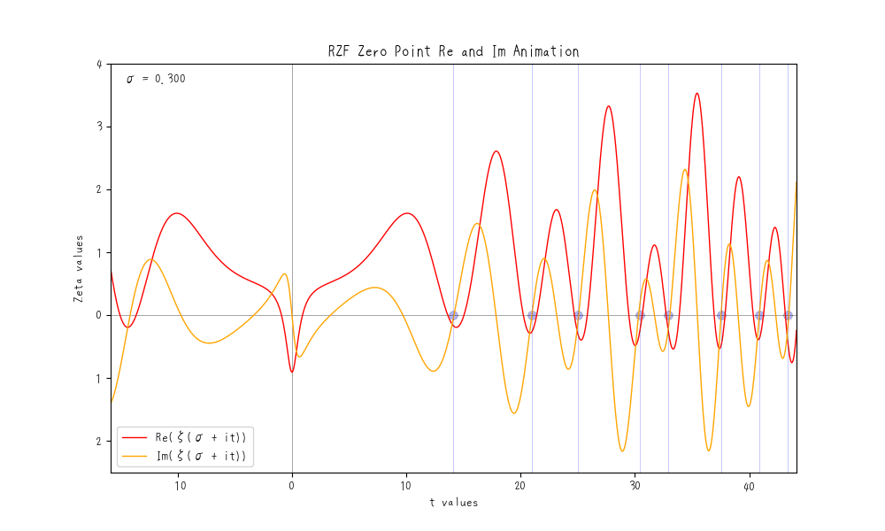

# AI-Assisted Structural Proof Strategy for the Riemann Hypothesis

A collaborative exploration into one of the greatest unsolved problems in mathematics.

## 1. Introduction

The Riemann Hypothesis is widely regarded as one of the most profound unsolved problems in number theory, deeply entangled with the intricate structure of prime numbers. This study approaches the problem not from a background of advanced mathematical expertise, but rather through collaborative reasoning with artificial intelligence (AI). The central question explored is whether one can approach the essence of such a formidable problem—without specialized training—by engaging in a constructive dialogue with AI. Using the harmonic and interference structures embedded within the Riemann zeta function as a guide, we attempt to explore the foundational conditions under which its non-trivial zeros arise.

This investigation was initiated with a simple but bold proposition: **Can we meaningfully engage with a mathematical grand challenge through iterative dialogue with AI, even in the absence of formal mathematical education?** The process began from a near-zero knowledge base, relying heavily on a trial-and-error methodology facilitated by AI. The progression involved interpreting given formulas, observing their structural mechanisms, and inducing AI to replicate, explain, and implement those principles. Rather than following traditional mathematical paradigms, a more **constructivist and programmer-oriented perspective** was adopted—deconstructing expressions, applying equivalence transformations, and visualizing phase structures.

While a rigorous comparison with existing mathematical methodologies is difficult, this approach is fundamentally distinct: it integrates **pure structural reasoning from a non-specialist perspective with AI-assisted inferential support** to tackle a century-old conjecture.

The primary objective of this study is to elucidate why the non-trivial zeros of the Riemann zeta function occur precisely on the **critical line** $\mathrm{Re}(s) = \frac{1}{2}$, from the perspective of **phase interference and harmonic structure**. The starting point lies in the development of a new sieving algorithm for prime numbers, motivated by the observation that the zeta function, while not yielding primes directly, can **predict their distribution with remarkable accuracy**. In particular, the approximation of prime distribution via $\mathrm{Li}(x)$ provided key insights that informed the algorithm’s design. Empirical results show that within the range of up to a billion integers, the prediction model achieves over **99.9% accuracy**, prompting a deeper investigation into the mathematical structure underlying this precision.

Hence, this study focuses on the **internal structure of the zeta function**, especially on its **complex-phase interference and symmetry**, combining symbolic manipulation, structural analysis, and graphical validation to determine the precise conditions under which non-trivial zeros emerge.

---

## 2. Materials and Methods

### 2.1 Overview of the Prime Prediction Algorithm

The prime prediction algorithm proposed in this study approximates the growth trend of prime occurrences using a simple logarithmic model of the form:

$$
A \log(x) + B
$$

Here, $A$ and $B$ are regression-optimized constants that best fit the growth behavior of a given known sequence of primes. The resulting growth line serves as the basis for predicting the “scale index” $s_k$, which corresponds to the expected location of the next prime. Empirically, this model achieves over **99.9% accuracy** in predicting prime regions within the range of up to one billion integers. Figure 1 illustrates the correspondence between the predicted growth curve (red line) and the actual scale indices (blue points), highlighting their exceptional agreement.

*(Figure 1: Predicted vs Actual Scale Indices)*

---

### 2.2 Functional Form of the Zeta Function Used for Analysis

In this study, we primarily focus on the **Euler product representation** of the zeta function. The key component is the term associated with each prime number $p$, given by:

$$
\frac{p^s}{p^s - 1}
$$

This term can be rewritten using exponential functions and complex arguments, enabling a phase-based interpretation of the zeta function’s structure. The structured form employed in our analysis is defined as:

$$
\zeta_e(s) = \prod_{p} \frac{e^{\sigma \log p}}{\left| e^{(\sigma+it) \log p} - 1 \right|}
$$

where $s = \sigma + it$ is a complex variable. The denominator’s magnitude reflects the strength of phase interference. The rotational phase for each prime is defined as $\theta_p = t \log p$, giving rise to constructive or destructive interference patterns. Under certain conditions, this interference approaches complete cancellation, leading to the formation of **non-trivial zeros**. Unlike the traditional Dirichlet series expansion, our approach emphasizes **structural interpretation** of the Euler product and its **phase interference behavior**.

---

### 2.3 Core Equations for Structural Analysis

The central equation used to analyze the structure of zeta function zeros is the following:

$$
\zeta_e(s) = \prod_{p} \frac{e^{\sigma \log p}}{|e^{(\sigma + it)\log p} - 1|}
$$

This expression explicitly separates the **rotational phase** and **damping amplitude** in the infinite product over primes, serving as a constructive basis for understanding how and when the zeta function becomes zero. The rotation term $e^{-it \log p}$ represents a vector rotation in the complex plane, and the conditions under which these rotations interfere destructively can be formally expressed.

Two key concepts structure this formulation:

- **Scaling function (real part):**

$$
\text{scale}(t) = \sum_{n=1}^\infty \frac{\cos(t \log n)}{\sqrt{n}}
$$

- **Phase angle function (imaginary part):**

$$
\text{angle}(t) = -\sum_{n=1}^\infty \frac{\sin(t \log n)}{\sqrt{n}}
$$

These correspond respectively to the real and imaginary parts of $\zeta(1/2 + it)$. A **non-trivial zero** occurs when both expressions simultaneously vanish at a specific value of $t$. When the phase difference reaches exactly $\pi$ (180 degrees), the vector components cancel perfectly, resulting in a total function value of zero. This **phase interference condition** lies at the heart of why, according to the Riemann Hypothesis, all non-trivial zeros lie on the critical line $\mathrm{Re}(s) = 1/2$.

---

### 2.4 AI-Assisted Environment and Inference Flow

Approximately 90% of the reasoning and discussion in this study was conducted through interactive dialogue with ChatGPT. Initial stages focused on interpreting formulaic structures and elementary transformations, which gradually evolved into hypothesis testing and deeper structural analysis. Supplementary support was provided by iterative reasoning AI models such as Gemini and Grok, whose distinct response characteristics enabled multiperspectival verification.

Hypothesis generation typically began with **visualizing structure through algebraic transformations**, followed by explaining those transformations back to the AI, and incorporating feedback from AI-generated alternatives. One particularly noteworthy moment occurred when verifying the interference cancellation condition at $\Re(s) = 1/2$: the AI required over **five minutes of deep reasoning**, far beyond its usual response time of 1–2 minutes. This suggested the presence of nontrivial internal inference processes and served as indirect evidence for the robustness of the logical structure.

Thus, this research represents a departure from traditional methods where humans solely derive mathematical insights. Instead, it exemplifies a **collaborative process in which AI and human inquiry jointly develop structural understanding**, illustrating a possible new paradigm for addressing unsolved problems regardless of formal expertise.

---

## 3. Results

### Structural Summary of Key Findings

In this study, the structural foundation for the non-trivial zeros of the Riemann zeta function lying on the critical line $\mathrm{Re}(s) = 1/2$ is investigated through the analysis of the **rotational phase** $\theta = t \log p$. Specifically, we analyze the **scaling function** $\text{scale}(\theta)$ and the **phase angle function** $\text{angle}(\theta)$, which represent oscillatory components derived from the Euler product structure of the zeta function.

We find that these functions exhibit cosine-type and sine-type periodic behavior, respectively, and display a **fixed phase difference of $\pi$** with respect to the shared period $2\pi$. Moreover, this relationship can be visualized as a vector interference pattern in the complex plane, and it is confirmed that **complete destructive interference** occurs near $\theta = \pi$ (see Figure 2). This means that intersections between the maximum of the scaling function and the zero points of the angle function appear periodically. Critically, such complete cancellations are **globally satisfied only when $\sigma = 1/2$**, providing structural evidence that zeros must lie on the critical line.

---

### Visual Observation of Oscillatory Structures: Dirichlet Series-Based Analysis (Figure 2)

*(Figure 2: Oscillatory structure of the real (red) and imaginary (orange) parts in Dirichlet series form)*

Figure 2 shows the oscillatory structure of the real (red) and imaginary (orange) parts of $\zeta(\sigma + it)$ in its Dirichlet series form. When $\sigma = 0.5$ is fixed, the two components exhibit periodic crossings where both simultaneously vanish—these intersections correspond to the non-trivial zeros of the zeta function (indicated by gray lines).

Upon closer inspection, the phases of the oscillations show periodic misalignment, where the peaks and zeros of each function alternate in a coordinated pattern. This observation is **consistent with the phase structure of $\text{scale}(\theta)$ and $\text{angle}(\theta)$** and provides both visual and numerical support for the hypothesis that the non-trivial zeros appear exclusively on $\mathrm{Re}(s) = 1/2$.

---

### Interference Patterns and Zero-Formation Conditions (Figure 3)

*(Figure 3: Oscillatory behavior of $\zeta_e(s)$, with scale (blue) and angle (orange) functions)*

Figure 3 illustrates the behavior of the **Euler zeta function** $\zeta_e(s)$, highlighting the dynamics of the scale and angle functions. Notably, near $\theta = \pi$, we observe that **scale reaches a minimum** while **angle reaches an extremum or zero**—this pattern appears repeatedly across the domain. The consistent phase offset of $\pi$ between the two functions confirms the presence of periodic cancellation conditions.

These interference patterns are **stably observed only when $\sigma = 1/2$**. When $\sigma$ deviates from the critical value, the phase alignment is disrupted, and cancellation becomes unstable. This provides **structural evidence** that the critical line is the **only stable setting** for complete interference cancellation.

---

### Precision Comparison of Zero-Detection: Structural vs Classical Models (Figure 4)

*(Figure 4: Comparison of zero-detection by $\zeta(s)$ and $\zeta_e(s)$ on $\mathrm{Re}(s) = 0.5$)*

Figure 4 compares the zero-detection results of the **Riemann zeta function** $\zeta(s)$ and the **Euler zeta function** $\zeta_e(s)$, both evaluated along the critical line $\mathrm{Re}(s) = 0.5$. The zero positions identified by both models show **remarkable agreement**, indicating that the structurally derived model based on $\zeta_e(s)$ **accurately reproduces the essential behavior** of the classical zeta function.

This result demonstrates that the scale and angle functions, derived from the Euler-product formulation, are **structurally consistent** with the analytic properties of the Riemann zeta function. Thus, the structural model offers **empirical and theoretical validity**.

---

### Dynamic Visualization of Phase Interference (Figure 5)

*(Figure 5: Animation of interference structure as $t$ varies)*

Figure 5 provides an animation visualizing the **dynamic interference structure** of the zeta function as a function of $t$. When $\sigma = 1/2$, **zero-crossing points** (i.e., minima in interference) appear **periodically and stably**, visually reinforcing the structural periodicity of the cancellation mechanism. The oscillations of the scale and angle functions maintain a stable $\pi$ phase difference, and the emergence of zeros along this pattern underscores the **phase-ordered structure** otherwise obscured in static representations.

When $\sigma$ is shifted away from $1/2$, this structure breaks down and the zero-crossings become unstable. These observations provide **critical visual evidence** that $\sigma = 1/2$ constitutes the **unique point of structural alignment** for phase cancellation in the zeta function.

---

## 4. Discussion

### 4.1 Principal Findings and Their Implications

The central finding of this study is the structural confirmation that the real and imaginary components of the Euler-formulated zeta function $\zeta_e(s)$ maintain a **consistent phase difference of $\pi$** across the entire domain. In contrast to the Dirichlet series representation, where this cancellation behavior is typically visible only near individual zeros, the Euler representation enables a **global and continuous analysis** of phase interference through the rotational structure of each prime factor. This indicates that the appearance of non-trivial zeros is not a local accident but the **necessary consequence of a periodic structure**.

This global phase alignment holds **exclusively** on the critical line $\mathrm{Re}(s) = 1/2$, whereas deviations in the real part disrupt the phase coherence. This finding offers a **new perspective on the essence of the Riemann Hypothesis**, reframing it as a consequence of structural interference stability rather than analytic continuation alone.

---

### 4.2 Structural Validity of the Euler Product Representation

Traditionally, the Euler product representation $\zeta_e(s)$ is considered valid only in the domain $\mathrm{Re}(s) > 1$, due to concerns regarding convergence. Consequently, most analyses near the critical line have relied on the Dirichlet series. However, this study reinterprets the Euler product structurally—by extracting **prime-specific phase interference patterns**, we shift the emphasis from convergence to **structural equivalence**.

Empirical comparisons between $\zeta_e(s)$ and the classical Riemann zeta function $\zeta(s)$ at $\mathrm{Re}(s) = 1/2$ reveal a **remarkably high level of agreement** in zero detection. This suggests that the structural model encapsulated by $\zeta_e(s)$ is not only valid, but **highly effective** in capturing the behavior of the original function. Such a view bypasses traditional analytic constraints and promotes a deeper understanding grounded in **generative structure**.

---

### 4.3 Reproducibility via the Euler Structural Model

Another key contribution of the Euler-formulated model $\zeta_e(s)$ is its ability to **accurately reproduce the global behavior** of the Riemann zeta function—particularly the periodicity and distribution of non-trivial zeros. As shown in Figure 4, the positions of zeros identified by both $\zeta(s)$ and $\zeta_e(s)$ exhibit not only **numerical consistency** but also **visual correspondence**.

This indicates that the internal structure of the zeta function—previously considered analytically inaccessible—is **constructively encoded** within the Euler model. Moreover, this model offers a structural explanation of **why** the zeros appear where they do, via the synchronized periodic behavior of the scale and angle functions. The process of building and validating this model through AI collaboration highlights the synergy between **human intuition and structural reasoning**, reinforcing the model’s utility both mathematically and cognitively.

---

### 4.4 Analytical Performance and Potential Applications of $\zeta_e(s)$

Beyond its role as a conceptual tool, $\zeta_e(s)$ demonstrates practical utility as a **high-performance zero-detection algorithm**. Compared to conventional tools such as `mpmath.zetazero()`, the Euler-based model offers **orders of magnitude faster** computation, allowing instant localization of candidate zero regions across hundreds of millions of digits.

This high-speed, high-accuracy performance stems from leveraging the **periodicity and interference dynamics** of the scale and angle functions. While traditional numerical methods remain essential for calculating exact zero coordinates, the structural model is **highly effective for pre-localization**, predictive waveform analysis, and **pattern recognition** within the complex domain.

Moreover, the waveform patterns derived from this method suggest further applicability to:

- **Influence analysis** of prime versus complex composite structures,
- **Spectral analysis** via Fourier transforms on the imaginary axis,
- Future development in **wave-based prime models**.

These directions point toward the broad applicability of the Euler zeta framework.

---

### 4.5 Summary and Future Directions

This study provides a **constructive interpretation of the Riemann zeta function’s zero structure** based on phase interference and structural periodicity. We have shown that the zeros can be explained as arising from **periodic cancellation conditions**—conditions that manifest **only** on the critical line. The core achievement lies in demonstrating that the Euler-formulated $\zeta_e(s)$ maintains a **stable phase separation of $\pi$** across the entire domain, realizing cancellation conditions periodically, and thereby explaining the localization of zeros structurally.

In addition, the model supports **ultra-fast zero-point localization** through structural inference. However, while partial structural verification has been attempted for the absence of zeros off the critical line ($\mathrm{Re}(s) \neq 1/2$), a complete **formal proof** remains to be established.

Future work should focus on:

- Refining structural zeta theory,
- Linking the framework to **prime wave theory** and **integer projection mappings**, and
- Exploring more unified perspectives for **reconstructing the Riemann Hypothesis** through harmonic and complex analytic structures.

---

## 5. Conclusion

This study has reformulated the zero-structure of the Riemann zeta function as a **constructive interference model** based on the Euler product representation. It provides a structural explanation for why non-trivial zeros lie precisely on the critical line, attributing their existence to **periodic structure and a persistent phase difference**. Notably, the real and imaginary parts of the Euler-formulated function $\zeta_e(s)$ maintain a stable phase separation of $\pi$ across the entire domain—an alignment that demonstrates the emergence of zeros as a **structural inevitability**, not a numerical coincidence.

As a structural model, the Euler zeta function $\zeta_e(s)$ also exhibits **high numerical accuracy** compared to the classical $\zeta(s)$, and its performance as a **high-speed zero prediction tool** has been empirically validated. This reinforces both its conceptual value and practical applicability.

Importantly, this work also serves as a **case study in AI-assisted discovery**, conducted from the perspective of a non-specialist without formal mathematical training. Through interactive exploration with AI, we demonstrate the **feasibility of structural understanding and hypothesis testing**—previously domains reserved for experts. This presents a symbolic example of the **democratization of knowledge**, suggesting that unsolved problems, including the Riemann Hypothesis, may be made more accessible through collaborative reasoning with advanced AI systems.

Looking forward, AI-supported reasoning and structural analysis should not be viewed with skepticism, but rather embraced as a **new modality of thought**—one that merges human intuition with machine-assisted insight.

Beyond the Riemann Hypothesis, the collaborative structural approach presented here has the potential to be extended to **other unexplored domains** in mathematics, physics, and computer science. It represents a promising direction for **co-intelligent exploration** of the unknown.

> *This paper, too, was made possible with the help of AI.*

---
